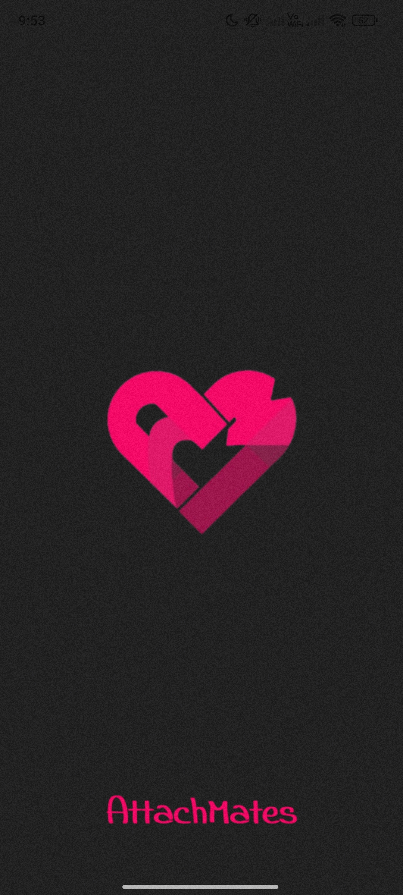
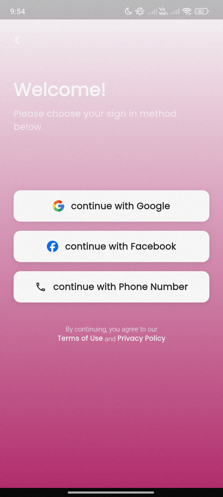
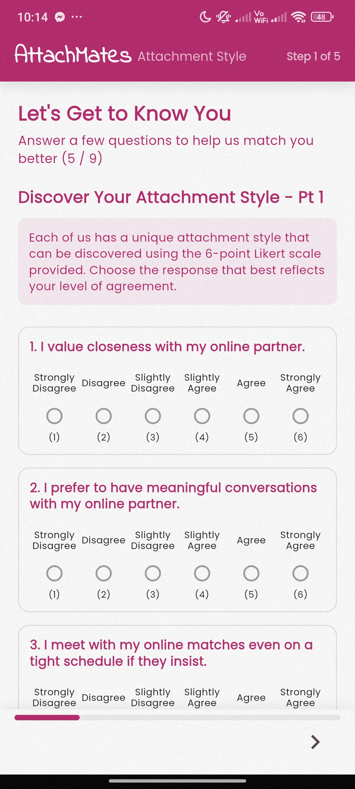
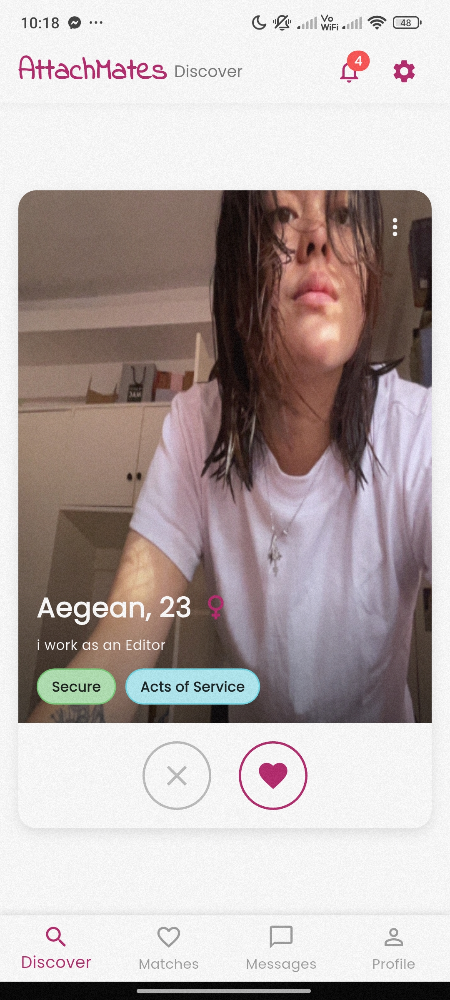
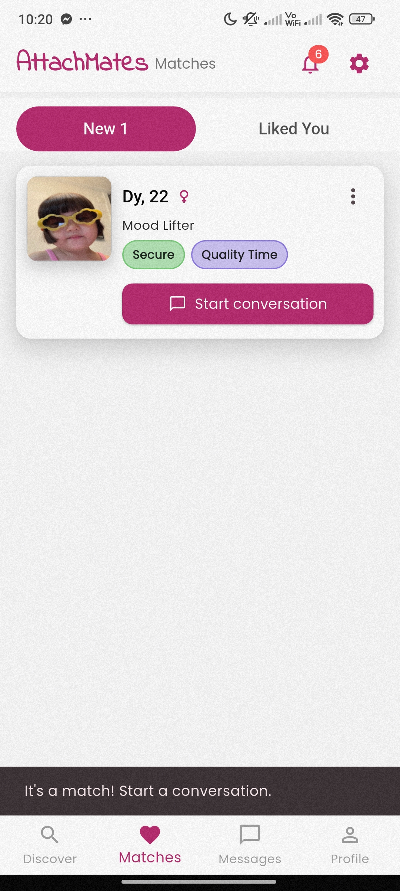
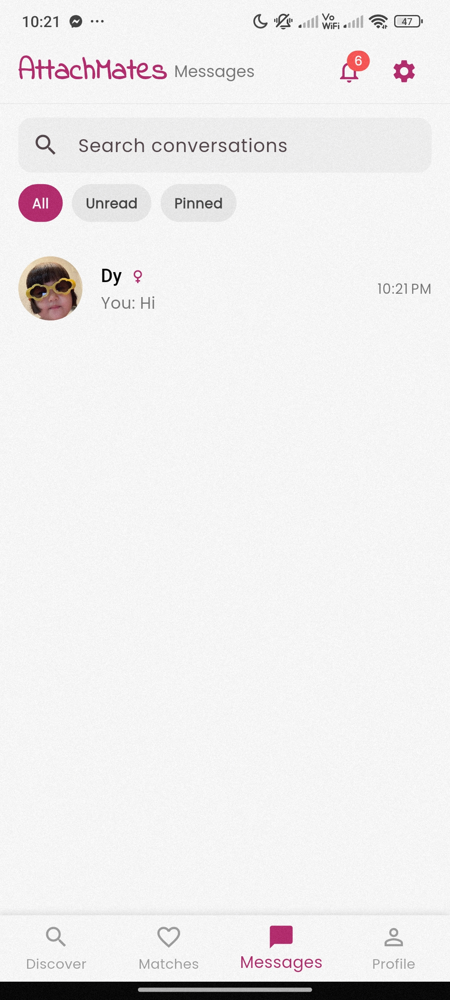
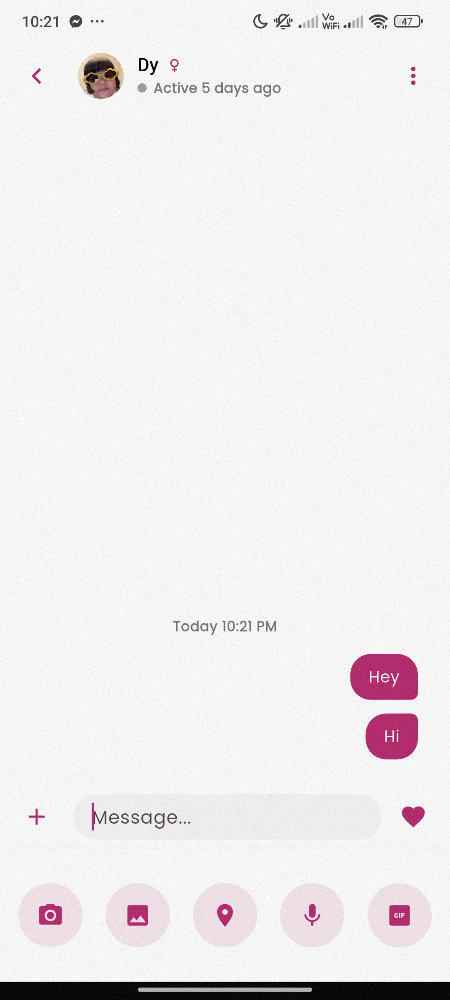
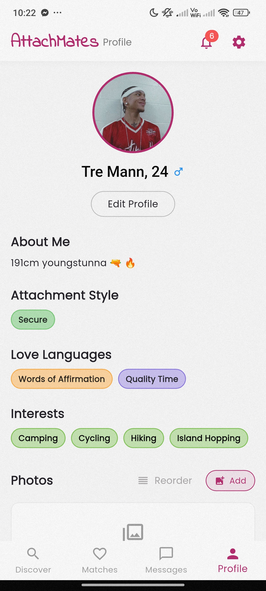

<p align="center">
  
</p>

# AttachMates

**Psychology-powered dating — because real connections start with emotional understanding.**

<p>
  
  
  
  
  
  
</p>

> **This is the Flutter frontend (Android).** The backend lives at [`attachmates-backend`](https://github.com/chaszuuu/attachmates-backend).

---

## What is AttachMates?

Most dating apps prioritize physical appearance and fast interactions — leading to emotional mismatches and dating fatigue. **AttachMates** takes a different approach.

Built on **Attachment Theory** (Bowlby & Ainsworth) and the **Five Love Languages Framework** (Chapman), AttachMates matches users based on psychological compatibility. Our AI-powered hybrid recommendation system analyzes your attachment style and love language to surface partners who genuinely align with how you connect and love.

---

## Screenshots

### Splash & Auth
| Splash | Auth |
|--------|------|
|  |  |

### Quiz & Discovery
| Quiz | Discover | Matches |
|------|----------|---------|
|  |  |  |

### Messaging & Profile
| Messages | Conversation | Profile |
|----------|--------------|---------|
|  |  |  |

---

## Tech Stack

| Layer | Technology |
|-------|------------|
| Mobile (Android) |  |
| Language |  |
| Authentication |  |
| Database |  |
| Media Storage |  |
| Notifications |  |
| Backend API |  |

---

## Features

- 🧠 **Psychological Onboarding** — LoveByte Test (attachment style) + Five Love Languages assessment before matching
- 🤖 **AI-Powered Matching** — Hybrid rule-based + content-based recommendation engine
- 💞 **Mutual Matching** — Matches only form when both users like each other
- 💬 **Private Messaging** — Text, photos, and voice messages via Supabase Storage
- 🏳️‍🌈 **Orientation Filtering** — Filter by gender identity and sexual orientation
- 🔐 **Role-Based Access** — Superadmin → Admin → User hierarchy
- ✅ **Manual Verification** — Admins review and approve/decline user applications
- 🚫 **Server-Side Blocklist** — Blocked profiles disappear from both sides
- 🔒 **Privacy First** — Firebase security rules, no third-party data selling, deletable accounts

---

## How Matching Works

1. **Attachment Style** — Identified via the LoveByte Test (Secure, Anxious, Avoidant, Disorganized)
2. **Love Language Score** — Words of Affirmation, Acts of Service, Receiving Gifts, Quality Time, Physical Touch
3. **Hybrid Recommendation** — Rule-based psychological filtering + content-based preference matching, powered by OpenAI embeddings on the backend

---

## Getting Started

### Prerequisites

- [Flutter SDK](https://docs.flutter.dev/get-started/install) `>= 3.x`
- Dart `>= 3.x` (bundled with Flutter)
- Android Studio
- A running instance of [attachmates-backend](https://github.com/chaszuuu/attachmates-backend)

### Installation

```bash
git clone https://github.com/chaszuuu/attachmates.git
cd attachmates

flutter pub get

cp .env.example .env
# Fill in your BASE_URL and Firebase/Supabase keys

flutter run
```

### Environment Variables

```env
BASE_URL=https://your-render-url.onrender.com
# Firebase and Supabase keys as needed
```

> ⚠️ Never commit `.env`. It's already in `.gitignore`.

### Build for Release

```bash
# APK
flutter build apk --release

# App Bundle
flutter build appbundle --release
```

---

## Project Structure

```
attachmates/
├── android/          # Android native config
├── assets/           # Images, icons, UI assets
├── ios/              # iOS native config
├── lib/
│   ├── core/         # Constants, themes, utilities
│   ├── models/       # User, Match, Quiz, Chat models
│   ├── screens/      # UI screens (auth, quiz, discover, chat, profile)
│   ├── widgets/      # Reusable UI components
│   ├── services/     # Firebase, Supabase, API calls
│   ├── providers/    # State management
│   ├── routes/       # Navigation & routing
│   └── main.dart     # Entry point
├── test/             # Unit & widget tests
├── pubspec.yaml      # Dependencies
└── .env              # Local env vars (gitignored)
```

---

## Roadmap

- [x] Attachment style profiling
- [x] Love language assessment
- [x] AI hybrid matching
- [x] Mutual match discovery
- [x] Private messaging (text, photo, voice)
- [x] Orientation filtering
- [x] Role-based access (superadmin / admin / user)
- [x] Manual ID verification
- [x] Server-side blocklist
- [ ] iOS support
- [ ] Larger user capacity
- [ ] Compatibility breakdown UI
- [ ] Premium tier

---

## Related

- [attachmates-backend](https://github.com/chaszuuu/attachmates-backend) — Python / FastAPI backend

---

<p align="center">Built with love (and psychology) by <a href="https://github.com/chaszuuu">@chaszuuu</a> 💘</p>
